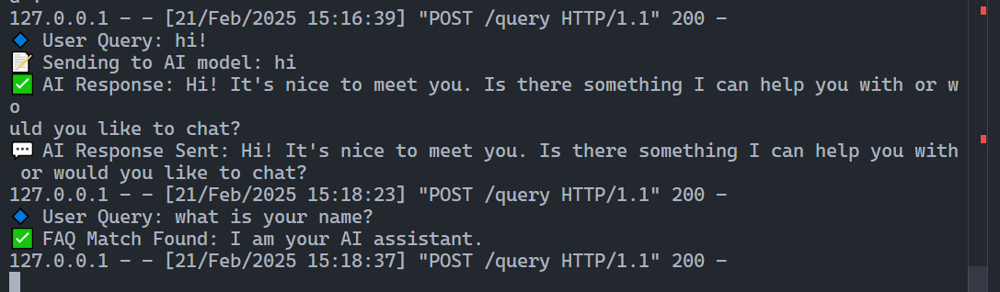
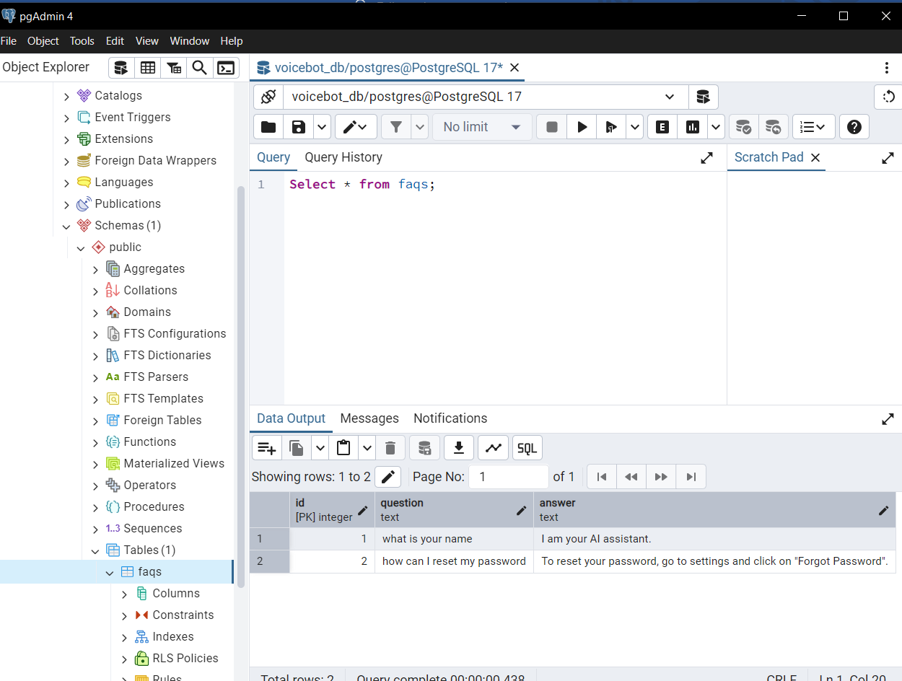
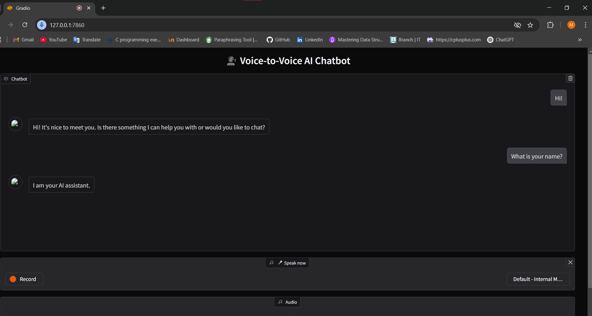

# 🗣️ Voice-to-Voice AI Chatbot

## **📌 Overview**
This Voice-to-Voice AI Chatbot allows users to interact with an AI using voice commands. It transcribes speech, fetches intelligent responses, and speaks back the results. The chatbot supports FAQs using a PostgreSQL database and dynamic AI-generated responses using the **Groq API**.

---

## **⚙️ Tech Stack**
- **Frontend**: Gradio (for UI)
- **Backend**: Flask (for API handling)
- **Database**: PostgreSQL (for FAQs)
- **AI Model**: Groq API (for dynamic responses)
- **Speech Processing**: Whisper (for STT), gTTS (for TTS)

---

## **🚀 Features**
✅ **Voice Input & Output** – Speak and listen to AI responses.  
✅ **FAQ Integration** – Uses PostgreSQL to fetch predefined answers.  
✅ **AI-Powered Responses** – Queries Groq API for conversational AI.  
✅ **Gradio UI** – Simple interface for interaction.  
✅ **Flask API** – Manages user queries and chat history.  

---

## **🛠️ Installation & Setup**
### **1️⃣ Install Dependencies**
```bash
pip install gradio whisper openai gtts flask psycopg2-binary requests
```

### **2️⃣ Set Up PostgreSQL Database**
1. **Create a database** in pgAdmin (e.g., `voicebot_db`).
2. **Create a table for FAQs**:
   ```sql
   CREATE TABLE faqs (
       id SERIAL PRIMARY KEY,
       question TEXT NOT NULL,
       answer TEXT NOT NULL
   );
   ```
3. **Insert Sample FAQs**:
   ```sql
   INSERT INTO faqs (question, answer) VALUES ('What is your name?', 'I am a voice bot powered by AI!');
   ```

### **3️⃣ Configure Backend (Flask API)**
Update `backend.py` with your **PostgreSQL credentials**:
```python
DB_USER = "your_username"
DB_PASSWORD = "your_password"
DB_NAME = "voicebot_db"
DB_HOST = "localhost"
DB_PORT = "5432"
```

### **4️⃣ Start Flask Backend**
```bash
python backend.py
```
✅ **API Running at:** `http://127.0.0.1:5000`

### **5️⃣ Start Gradio Frontend**
```bash
python voicetovoice.py
```
✅ **Gradio UI Running at:** `http://127.0.0.1:7860`

---

## **🛠️ How It Works**
1️⃣ **User speaks into the mic.**  
2️⃣ **Whisper converts voice to text.**  
3️⃣ **Backend checks the query:**
   - If FAQ match is found → fetch from PostgreSQL.
   - Else → Send query to Groq API.
4️⃣ **AI generates a response.**  
5️⃣ **gTTS converts text to speech.**  
6️⃣ **Audio response is played back.**  

---

## **📷 Screenshots**
### **1️⃣ Flask Backend Running**


### **2️⃣ PostgreSQL Table (pgAdmin)**


### **3️⃣ Gradio Frontend UI**



